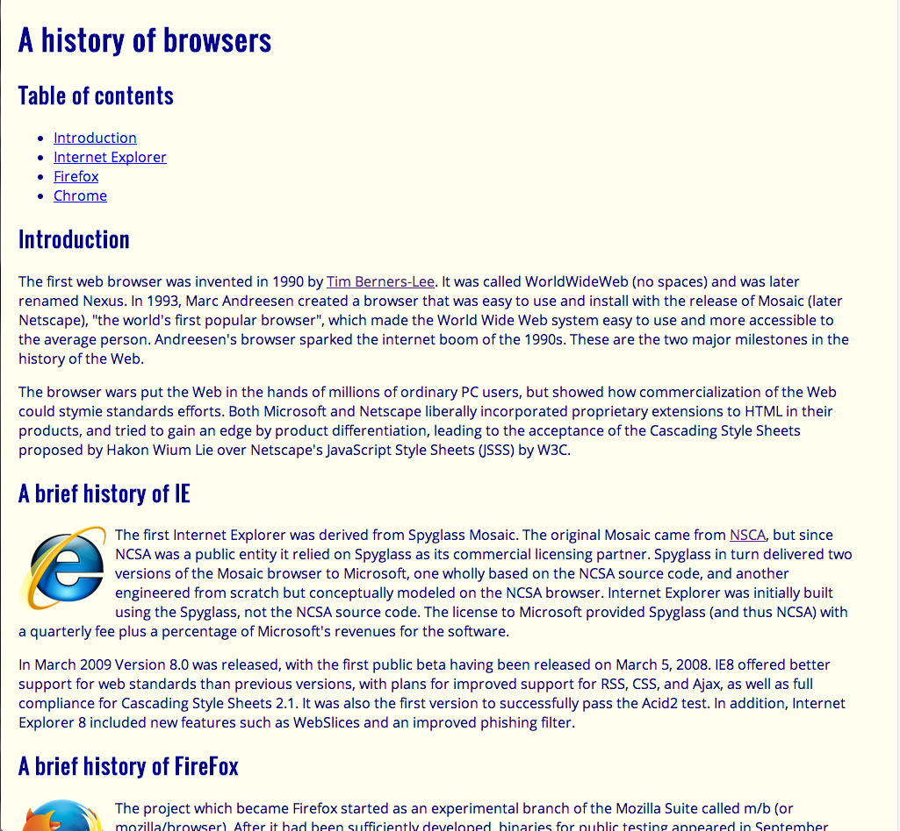
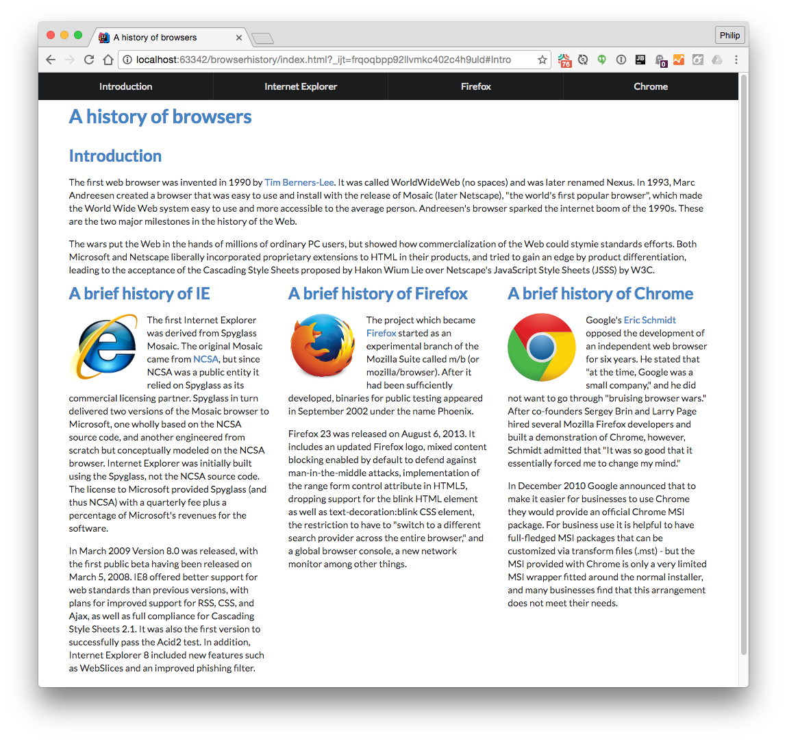

## HTML + CSS + Semantic UI

We saw what HTML could do. Then, we saw what HTML with CSS could do. Now, we know what HTML with CSS and Semantic UI can do together. Which is to create a beautiful and user friendly webpage, or "recreate" a beautiful and user friendly webpage, in our case.

Simply using just HTML and I was looking at a white webpage with black words and images. However, after tossing in a CSS stylesheet the appearance is increasingly more attractice with some color here, a column there. Could it get any better? Yes, it can and it did. After three hours of learning the components and elements of the Semantic UI framework, things just got more interesting.

## Time + Effort

Of course, learning a framework takes time and effort, as does everything. If you can transform a "styled" HTML code
