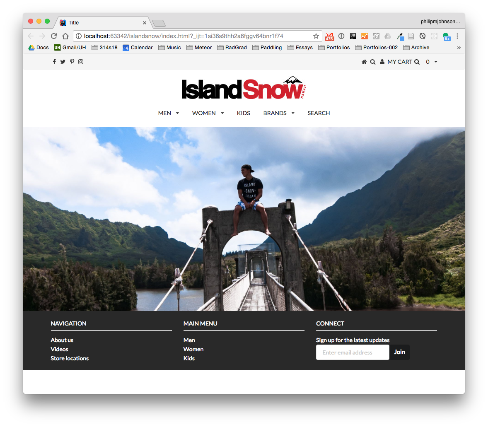

## HTML + CSS + Semantic UI

We saw what HTML could do. Then, we saw what HTML with CSS could do. Now, we know what HTML with CSS and Semantic UI can do together. Which is to create a beautiful and user friendly webpage, or "recreate" a beautiful and user friendly webpage, in my case.

Simply using just HTML and I was looking at a white webpage with plain black text and images, talk about boring. Then, after tossing in a CSS stylesheet the appearance is increasingly more attractice with some color here, a column there. Could it get any better? Yes, it can and it did. After three hours of learning the components and elements of the Semantic UI framework, things just got more interesting.

<div class="ui grid">
  <div class="center aligned row">
      
      
  </div>
  <div class="center aligned row">
      
      
  </div>
</div>

## Time + Effort

Of course, learning a framework takes time and effort, as does everything. However, the results are the ability to transform a simple "styled" HTML code into an everyday webpage, with all the bells and whistles.

The navigation bar at the top? Semantic UI. The image background that draws in your eyes? Semantic UI. The dropdown menu that whisks you away to another page? Semantic UI.

## Benefits

The benefits of learning and incorporating a framework such as Semantic UI, is the usability and appeal of the user interface. It is right in the name, UI (user interface).

The four images above were arranged using Semantic UI code. While it is still a small advancement in appearance, we can only go up from here.

```
<div class="ui grid">
  <div class="center aligned row">
      
      
  </div>
  <div class="center aligned row">
      
      
  </div>
</div>
```


