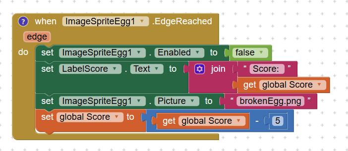

Catch the Egg is a gaming app that I developed through MIT AI2 App Inventor for ICS 110M. This project was a learning app for the course that was required to meet certain specifications that utilized knowledge gained throughout the course semester.

For this project, I was required to create an application that acted as an interactive game. The function of the game is to allow the user to move a "basket" that will catch falling "eggs". If the user catches an egg, the score will increase. However, if the user does not catch the egg, the score will decrease and the "egg" will break. The game resets until the user chooses to start over.

To complete this project, I created a new project on MIT App Inventor and first uploaded the designated images to the canvas. I was then able to design the user interface to display a prompt, score, reset and new game button, and a barn backdrop with 5 eggs and 1 basket. After completing the front-end of the app, I completed the coding portion. The block coding allowed the user to move the basket image, have the egg images falling at different speeds and change if it wasn't caught, adjust the score, and reset the egg drop or create a new game.

Through this project I was able to gain an interest in mobile app development. While the MIT AI2 App Inventor is an introduction that uses block coding, I hope to further this interest in a classroom setting that utilizes more advanced methods in mobile app development.

Here is a part of the code that controlled the "egg" if it dropped or was captured:

