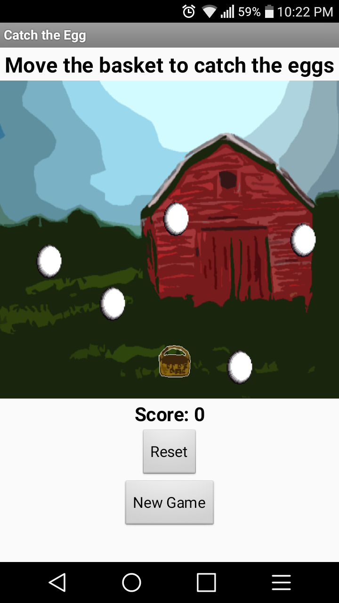
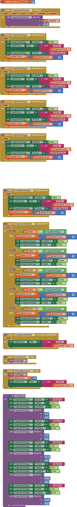

Catch the Egg is a gaming app that I developed through MIT AI2 App Inventor for ICS 110M. This project was a learning app for the course that was required to meet certain specifications that utilized knowledge gained throughout the course semester.

For this project, I was required to create an application that acted as an interactive game. The function of the game is to allow the user to move a "basket" that will catch falling "eggs". If the user catches an egg, the score will increase. However, if the user does not catch the egg, the score will decrease and the "egg" will break. The game resets until the user chooses to start over.

Through this project I was able to gain an interest in mobile app development. While the MIT AI2 App Inventor is an introduction that uses block coding, I hope to further this interest in a classroom setting that utilizes more advanced methods in mobile app development.

Below is the coding blocks used on MIT AI2 App Inventor:

  

