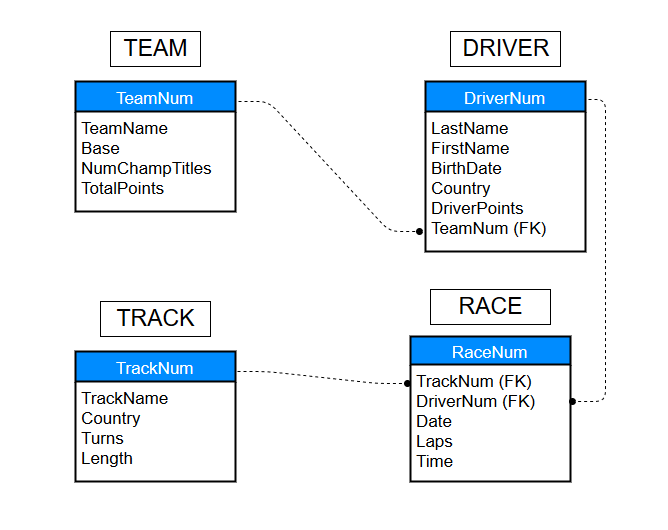

For this group project, we were required to create a database from scratch using the 2-step process: information-level design and physical-level design. The database had to have a purpose and a general theme.

My group decided to create a database for Formula 1 racing. The database included four tables that represented the teams, drivers, tracks, and scheduled races. Expanding further, each table included at least four relevant attributes, a primary key, and foreign keys that linked the tables together.

Overall, I acquired a leadership role on this project. Essentially, I made the big decisions on the approach we should take and the materials we should implement. This project allowed me the opportunity to further experience a leadership role and databases.

Source: <a href="http://www.leeward.hawaii.edu/ics-thehub">The Hub</a>
