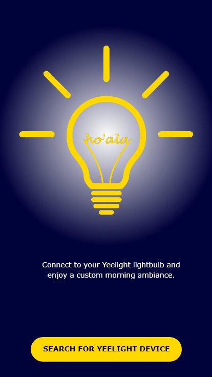
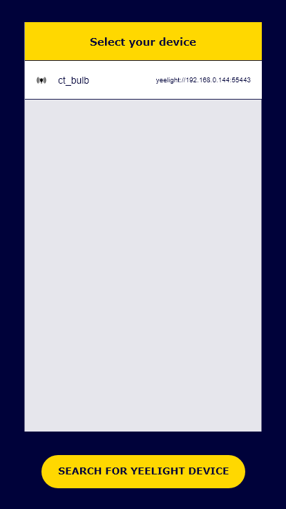
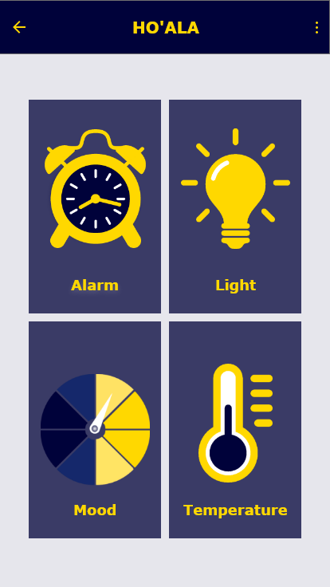
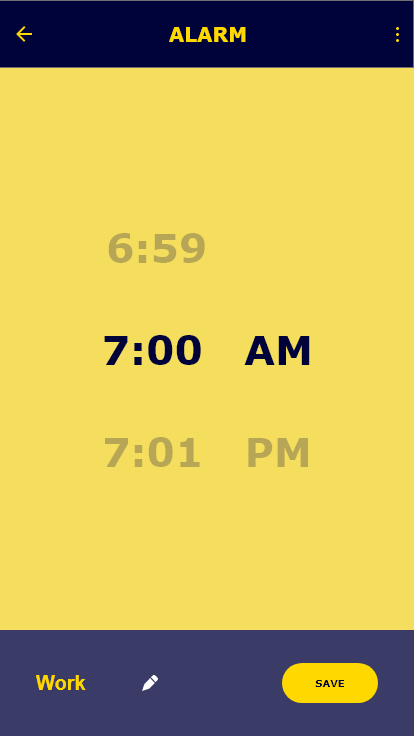
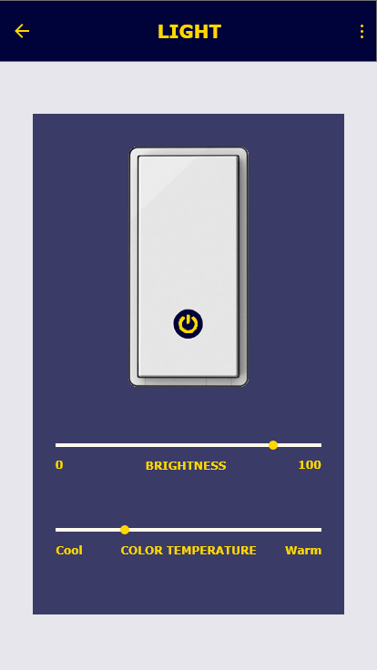
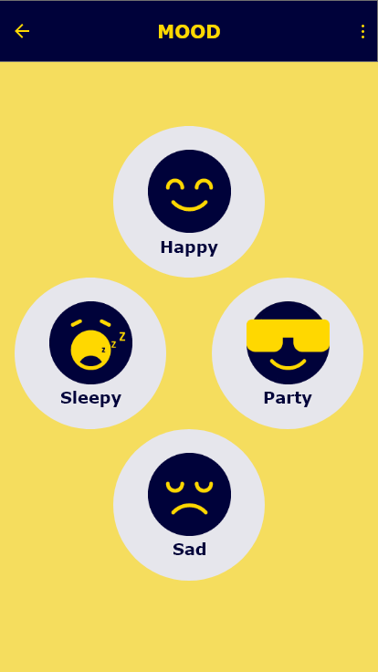
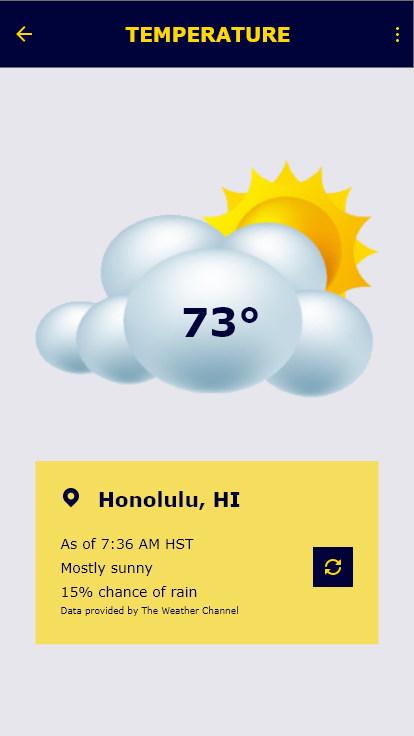

## Ho'ala YEELIGHT
For this group project, we were required to create a mobile or web application that connected to a YEELIGHT Smart LED light bulb. The application had to manipulate the light bulb to create an ambiance.

My group decided to create a mobile application using Android Studio. We decided on manipulating the light bulb to create a morning ambiance. The app allows the user to change the temperature and brightness of the light manually, turn on and off the light, set an alarm clock that gradually increases the brightness of the bulb to its brightest, and select a predetermined "mood" setting.

Since the group was downsized to a pair, I obtained the "lead" role and was mostly in possession of our light bulb. Utilizing the YEELIGHT API, we were easily able to program the app to connect with the bulb. Then, I was responsible for creating the user interface and programming the alarm, light, and mood settings. My partner was responsible for setting up the weather portion of the app to scrape data from a weather database.

## UI Design
Beginning the user interface design process, I was originally tasked with designing the Alarm feature. Our first milestone was paper prototyping, but we made digital prototypes for easy online submission.

  

    

      
      
Alarm Log Prototype

    

  

  

    

      
      
Set Alarm Prototype

    

  

By our third milestone, I was able to implement a basic user interface that successfully connects the mobile application to the bulb, include a feature to adjust the brightness and color temperature, and simply turn on and off the bulb.

At our final milestone, I had completed the alarm function. By the end of the completed project, I had also added a bonus function to allow the user to select from pre-set "moods" to adjust the light bulb to correlate with the mood selected. This function replaced the "Setting" selection that is shown in the app demo screenshots below.

  

    

      
      
Search Page

    

  

  

    

      
      
Devices Discovered Page

    

  

  

    

      
      
Home Page

    

  

  

    

      
      
Alarm Page

    

  

  

    

      
      
Adjust Bulb Page

    

  

  

    

      
      
Weather Page

    

  

## End Result
Overall, the complete UI of our app was minimalistic and simple in design. I will admit that it can definitely use some work to be more appealing and create a better user experience. However, we were only a group of two juggling multiple classes and a limited timeline. I do believe given more time and effort directed towards this group project, the end product could have a lot more potential.

The video of our app demo can be watched here: <a href="https://youtu.be/Kjq8xNxlP4o">Team Ho'ala App Demo</a>

<!-- ## UI Update Recreated with Adobe XD
I have recently decided to expand some of my skills and learn new software. Therefore, I used Adobe XD to recreate the UI design of our Ho'ala mobile application. It is a replication with some changes in color scheme and layout. Since I do not have Adobe Photoshop, I used Paint.net to design the image components.

  

    

      
      
Landing Page

    

  

  

    

      
      
Search and Discovery Page

    

  

  

    

      
      
Home Page

    

  

  

    

      
      
Alarm Page

    

  

  

    

      
      
Light Controls Page

    

  

  

    

      
      
Mood Page

    

  

  

    

      
      
Temperature Page

    

  

The main focus of recreating these UI prototypes was for me to familiarize myself with Adobe XD. Perhaps as my skills and knowledge of Adobe XD progress, I may redesign the UI to reflect a more modern and advanced style. -->
