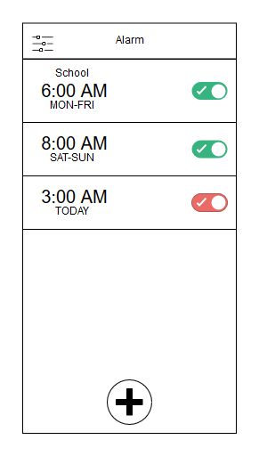
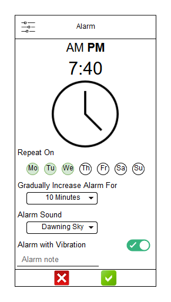
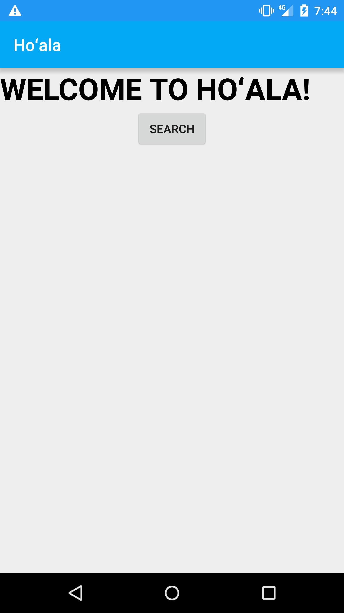
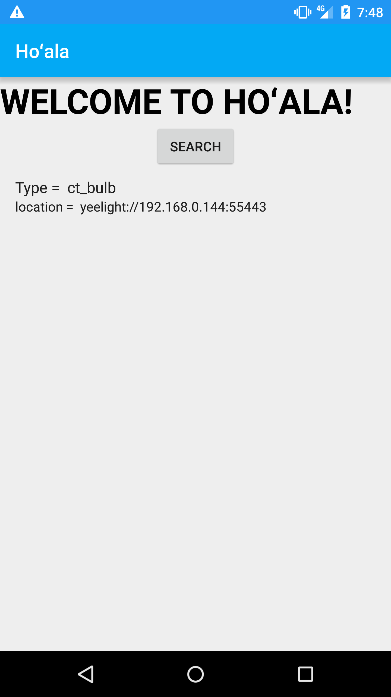
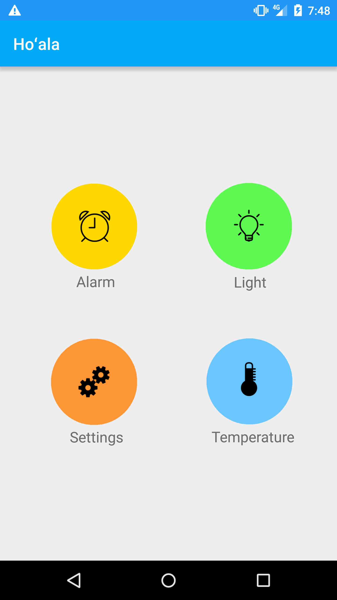
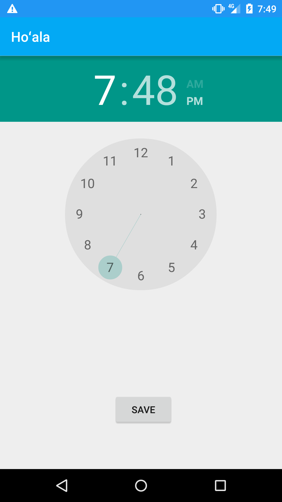
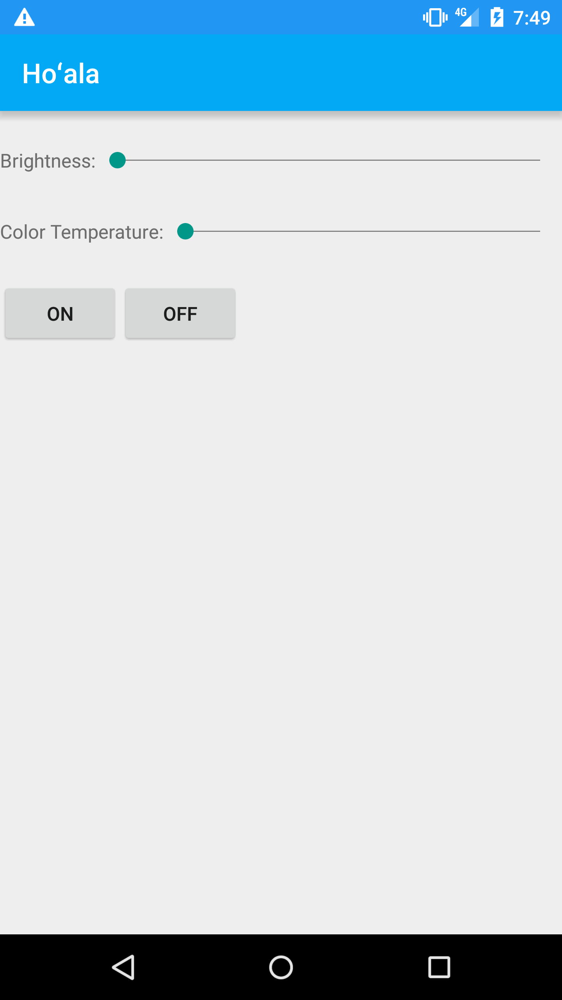
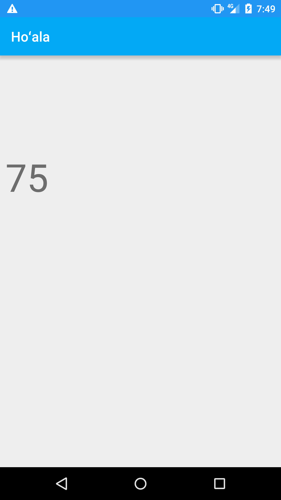

## Ho'ala YEELIGHT
For this group project, we were required to create a mobile or web application that connected to a YEELIGHT Smart LED light bulb. The application had to manipulate the light bulb to create an ambiance.

My group decided to create a mobile application using Android Studio. We decided on manipulating the light bulb to create a morning ambiance. The app allows the user to change the temperature and brightness of the light manually, turn on and off the light, set an alarm clock that gradually increases the brightness of the bulb to its brightest, and select a predetermined "mood" setting.

Since the group was downsized to a pair, I obtained the "lead" role and was mostly in possession of our light bulb. Utilizing the YEELIGHT API, we were easily able to program the app to connect with the bulb. Then, I was responsible for creating the user interface and programming the alarm, light, and mood settings. My partner was responsible for setting up the weather portion of the app to scrape data from a weather database.

## UI Design
Beginning the user interface design process, I was originally tasked with designing the Alarm feature. Our first milestone was paper prototyping, but we made digital prototypes for easy online submission.

<table style="margin-left:auto;margin-right:auto">
  <tr style="background-color:gray">
    <td>Alarm Log Prototype</td>
    <td>Set Alarm Prototype</td>
  </tr>
  <tr>
    <td></td>
    <td></td>
  </tr>
 </table>

By our third milestone, I was able to implement a basic user interface that successfully connects the mobile application to the bulb, include a feature to adjust the brightness and color temperature, and simply turn on and off the bulb.

At our final milestone, I had completed the alarm function. By the end of the completed project, I had also added a bonus function to allow the user to select from pre-set "moods" to adjust the light bulb to correlate with the mood selected. This function replaced the "Setting" selection that is shown in the app demo screenshots below.

<table style="margin-left:auto;margin-right:auto">
  <tr style="background-color:gray">
    <td>Search</td>
    <td>Found</td>
    <td>Home</td>
  </tr>
  <tr>
    <td></td>
    <td></td>
    <td></td>
  </tr>
  <tr style="background-color:gray">
    <td>Alarm</td>
    <td>Adjust</td>
    <td>Temperature</td>
  </tr>
  <tr>
    <td></td>
    <td></td>
    <td></td>
  </tr>
 </table>

The complete UI of our app was minimalistic and simple in design. Although it could have used more work to be more appealing and create a better user experience, we were only a group of two juggling multiple classes and a limited timeline. Our video of our app demo can be watched here: <a href="https://youtu.be/Kjq8xNxlP4o">Team Ho'ala App Demo</a>
