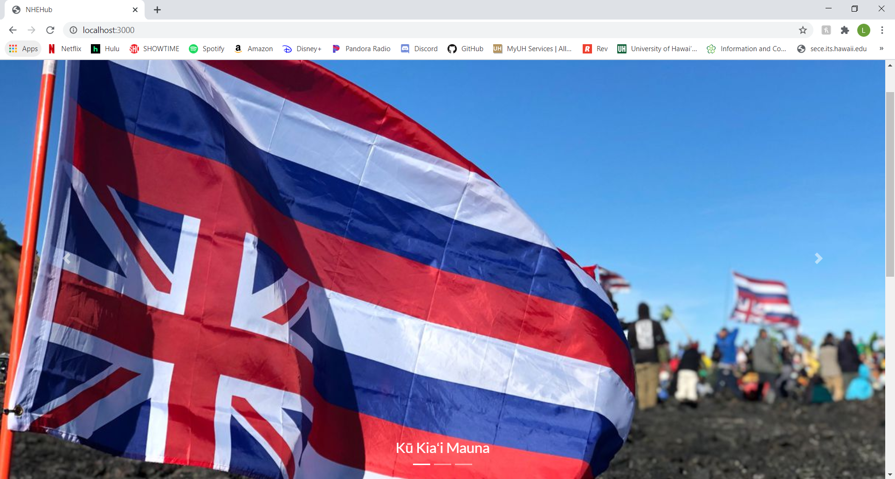

## The Native Hawaiian Enrichment Hub
The Native Hawaiian Enrichment Hub, or NHEHub, is a static React app developed as an independent final project for ICS 415: Intro to Programming for the Web. The project was focused on creating or enhancing the user interface/user experience for a new website or a current website.

NHEHub acts as a central hub for Native Hawaiian events, services, and workshops that enrich the community. The site would allow Native Hawaiians and Hawaii residents to get involved in the community, emerge themselves in the Native Hawaiian culture, locate resources and services, and participate in community events and workshops to enrich the Native Hawaiian people and the local society.

## Background
Instead of enhancing a current website, I chose to design a new website for Native Hawaiians because there was not a site that informs the Hawaii community about of Native Hawaiian events, services, and workshops. Specific groups and organizations would advertise their own resources, or locals could be informed through social media, word of mouth, fliers and banners, etc.

## Key Features
Since this was an independent project, I was the main and only contributor throughout the entire process. I chose the website topic, designed the mockups, and implemented the web application. However, due to the circumstances of it being a course project that was completed within the last month and a half of the semester, the site data was static and was presented through a screen recorded demo instead of a deployed site.

The main feature of the site that I wanted to showcase was the image carousel on the landing page. I utilized react-bootstrap to implement this feature.

  

    

      
      
Carousel Image 1

    

  

  

    

      
      
Carousel Image 2

    

  

  

    

      
      
Carousel Image 3

    

  

Another feature was the calendar to present upcoming and past events and workshops. One of the most difficult parts of the project was finding a way to implement the calendar feature and populate the calendar with data.

The demo of the website from 2019 can viewed here: <a href="https://youtu.be/81snQbHYL_s">NHEH Demo Video</a>

## Always Improving
While updating my portfolio in 2020, I decided on improving the user interface of the website since I was limited on time the first go around. I updated the landing page and directory page.

NHEH Landing Update

NHEH Directory Update

