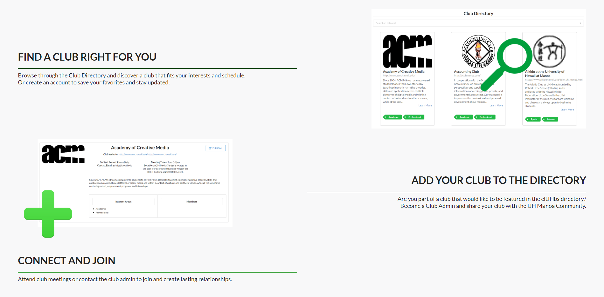

## Welcome to [Cluhbs](http://cluhbs.meteorapp.com/#/)
Cluhbs is a meteor application developed as a centralized directory for registered and unregistered clubs at the University of Hawaii at Manoa. This was a group project of four members with equal contributions to the end product.

The main purpose of clUHbs is to provide a simple and convenient way for UH students to find and connect with the different clubs offered at UH Manoa. While UH has a list of registered clubs and organizations, there are many that do not have this official recognition. There is also no user friendly directory that provides club information easily to the UH community. Therefore, the solution to this dilemma was implemented in the Cluhbs application.

## Teamwork Makes the Dream Work
For this project, my main contributions were to the landing page, club directory pages and edit club page. I also contributed to the cluhbs github page.

Working in a team, you always build off of each other, and this was definitely the case for this project. While I created the general mockup and layout for the club directory pages and edit club page, along the way other team mates would update and improve the functionality. As did I with the landing page.

The landing page was originally designed by one team mate, but in the end, I updated and
changed the entire layout, color scheme and logos of the Cluhbs application.

## On to the Next
Overall, I greatly enjoyed this project. Working on this project with a great team has truly pushed me to not give sub-par work. When I was struggling to figure out how to get the search bar to work on the directory page, my group was understanding and helpful.

I also feel so confident in my new found knowledge of how to create a working meteor application that I can definitely say that I will fiddle around with the tools I have acquired and maybe create another meteor application on my own.

GitHub Page: <a href="https://cluhbs.github.io/"><i class="large github icon "></i>clUHbs</a>
Visit us at: <a href="http://cluhbs.meteorapp.com/#/">clUHbs</a>
